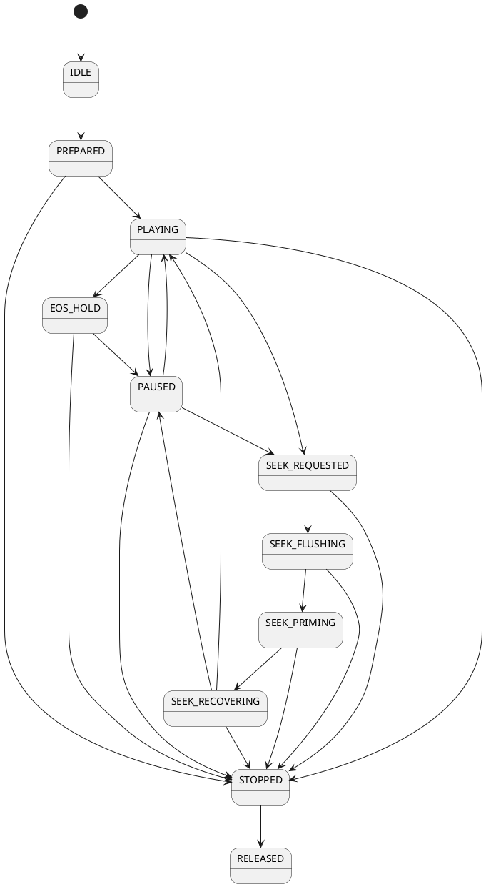
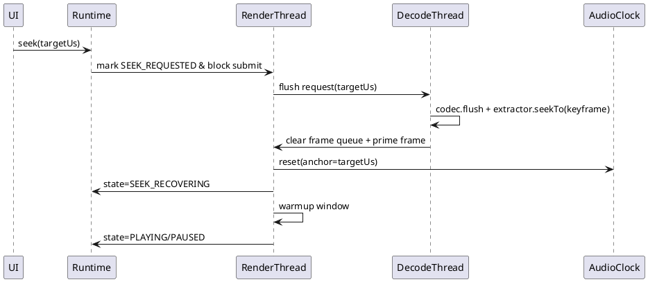

# 文档10：运行时行为冻结规范（P0/P1）

> 文档定位：工程冻结规范。
> 目标：将关键运行时行为定为“开发不可再变动约束”，直接指导编码与联调。
> 约束：不引入新架构/新技术栈，保持 Kotlin + JNI + C++17 + OpenGL ES + MediaCodec。

---

## 1. Seek 状态机冻结规范

### 1.1 状态定义（冻结）
- `IDLE`：未加载媒体，禁止解码与渲染提交。
- `PREPARED`：媒体与渲染资源已准备，允许首帧预取，禁止播放态时钟推进。
- `PLAYING`：时钟推进 + 解码 + 渲染提交开启。
- `PAUSED`：时钟冻结，允许保留最后一帧，禁止新渲染提交。
- `SEEK_REQUESTED`：接收 seek 命令，尚未停止渲染提交。
- `SEEK_FLUSHING`：执行 decoder flush / 清队列，禁止 render submit。
- `SEEK_PRIMING`：已定位关键帧，回填首批可显示帧，禁止 render submit。
- `SEEK_RECOVERING`：恢复时钟与渲染节流，允许受控 render submit。
- `EOS_HOLD`：解码 EOS，显示最后有效帧，禁止继续 decode。
- `STOPPED`：播放终止，资源待释放，禁止 render submit。
- `RELEASED`：全部资源销毁，不可再调用除 init 外接口。

### 1.2 状态转换（冻结）
- `IDLE -> PREPARED -> PLAYING`
- `PLAYING -> PAUSED -> PLAYING`
- `PLAYING/PAUSED -> SEEK_REQUESTED -> SEEK_FLUSHING -> SEEK_PRIMING -> SEEK_RECOVERING -> PLAYING/PAUSED`
- `PLAYING -> EOS_HOLD -> PAUSED/STOPPED`
- `任意非RELEASED状态 -> STOPPED -> RELEASED`

非法转换一律返回错误码并记录状态机告警日志，不允许隐式纠正。

### 1.3 状态机图（冻结）

### 1.4 Seek 时序图（冻结）

### 1.5 Flush / EOS / Recover 约束表（冻结）
| 项目 | 冻结规则 |
|---|---|
| Flush 触发点 | 仅 `SEEK_FLUSHING` 与 `STOPPED` 允许触发 decoder flush。 |
| Flush 顺序 | 先停 render submit，再 flush decoder，再清 frame queue，再 seekTo 关键帧。 |
| EOS 处理 | 进入 `EOS_HOLD` 后禁止继续 dequeue input，保留最后一帧，等待用户 seek/play/stop。 |
| Recover 条件 | 至少收到 1 帧有效视频帧 + AudioClock 已重锚点。 |
| Recover 超时 | 500ms 未恢复有效帧则上报 recover timeout 并降级到 `PAUSED`。 |
| 禁止 render submit 状态 | `IDLE/PREPARED/PAUSED/SEEK_REQUESTED/SEEK_FLUSHING/SEEK_PRIMING/STOPPED/RELEASED`。 |

### 1.6 线程切换点（冻结）
- UI/业务线程：只发控制命令（play/pause/seek/stop/release）。
- Runtime 控制线程：执行状态迁移校验。
- DecodeThread：执行 flush/seekTo/dequeue。
- RenderThread：执行队列消费、render submit、recover 窗口控制。

---

## 2. GL / EGL Ownership 冻结规范

### 2.1 Ownership（冻结）
- EGLDisplay/EGLContext/EGLSurface **仅 RenderThread 创建与销毁**。
- EGLContext owner 固定为 RenderThread；其他线程禁止 `eglMakeCurrent`。
- `updateTexImage()` **仅 RenderThread 调用**。
- SurfaceTexture 的 attach/detach **仅 RenderThread 调用**。

### 2.2 创建与销毁责任（冻结）
- 创建：RenderThread 在 `PREPARED` 阶段完成 EGL init + OES texture + SurfaceTexture bind。
- 销毁：RenderThread 在 `RELEASED` 流程完成 detach + GL destroy + EGL destroy。

### 2.3 RenderThread 生命周期（冻结）
- `start`：prepare 成功后启动。
- `active`：处理 render tick / onFrameAvailable / resize / seek recover。
- `quiesce`：stop/release 进入静默，拒绝新提交。
- `stop`：EGL 销毁后线程退出。

---

## 3. SurfaceTexture 生命周期冻结规范

### 3.1 生命周期状态（冻结）
`CREATED -> ATTACHED -> ACTIVE -> DETACHED -> RELEASED`

### 3.2 事件驱动规则（冻结）
- create：OES texture 创建后立即创建 SurfaceTexture。
- attach：RenderThread `eglMakeCurrent` 后 attach 到当前 GL context。
- pause：进入 `PAUSED` 保持 attach，不 release。
- resume：保持原 attach，恢复 `updateTexImage` 消费。
- detach：release 前或 context lost 后先 detach。
- release：detach 后释放 Java/Native 持有引用。

### 3.3 Context lost rebuild（冻结）
context lost 后必须按顺序 rebuild：
1. OES texture（必须重建）
2. SurfaceTexture（必须重建并重新绑定）
3. shader program（必须重建）
4. FBO（必须重建）
5. VAO/VBO（必须重建）

禁止复用旧 GL id。

---

## 4. AV Sync 参数冻结规范（可直接实现）

### 4.1 漂移区间定义（drift = videoPTS - audioClock）
- `|drift| < 20ms`：稳定区，不调速不丢帧。
- `20ms <= |drift| <= 80ms`：平滑纠偏区，仅调速。
- `|drift| > 80ms`：强纠偏区，允许受控丢/追帧。

### 4.2 Smooth adjust 规则（冻结）
- 正漂移（视频慢）：播放速率提升到 `1.00 ~ 1.03`。
- 负漂移（视频快）：播放速率降低到 `0.97 ~ 1.00`。
- 单次速率变更步长不超过 `0.005`，每 100ms 最多调整 1 次。

### 4.3 Drop/dup 与防振荡（冻结）
- 连续 drop 上限：3 帧；达到上限后强制进入 200ms 平稳窗口（仅调速）。
- 防振荡窗口：300ms 内禁止“调速->丢帧->调速”重复切换超过 2 次。
- seek 后稳定窗口：seek recover 后前 500ms 禁止 drop，仅允许调速。

### 4.4 AudioClock recover（冻结）
- seek 成功后以 `targetUs` 重置 anchor。
- 若音频设备重建（如焦点中断恢复），以第一帧可用 audio timestamp 重新锚定。
- 重新锚定后 300ms 内使用平滑区规则，禁用强纠偏。

---

## 5. RenderGraph 生命周期冻结规范

### 5.1 生命周期（冻结）
`INIT -> CONFIGURED -> RUNNING -> RECONFIGURING -> RUNNING -> RELEASED`

### 5.2 Pass in/out contract（冻结）
- 每个 pass 必须声明：输入纹理格式、输出纹理格式、尺寸、alpha 语义。
- OES 输入 pass 仅负责 OES->2D 采样转换，不叠加业务特效。
- 合成 pass 输入统一为 2D texture，输出为 RGBA 渲染目标。

### 5.3 FBO Pool 与复用 key（冻结）
- 复用 key：`width x height x internalFormat x sampleCount x usageTag`。
- 命中复用：仅当 key 全量一致。
- 不一致：必须新建，不允许降规格复用。

### 5.4 Resize rebuild（冻结）
- 发生 viewport/导出分辨率变化时进入 `RECONFIGURING`。
- 必须重建：所有依赖尺寸的 FBO/RT、相关 viewport 状态。
- 可复用：与尺寸无关的 shader program（context 未丢失前提下）。

### 5.5 Colorspace 与 Alpha（冻结）
- 预览与导出统一使用 BT.709 limited-range 处理链。
- 统一 premultiplied alpha 合成语义；所有 pass 不得混用 straight alpha。

### 5.6 生命周期归属（冻结）
- RenderGraph/FBO Pool/Pass 资源所有权归 Native Engine(RenderThread)。
- Runtime 仅下发参数，不直接持有 GL 资源句柄。

---

## 6. Release Destroy Order 冻结规范

严格顺序（不可改动）：
1. stop clock
2. stop render submit
3. flush decoder
4. clear frame queue
5. detach SurfaceTexture
6. destroy GL resource
7. destroy EGL
8. stop thread

### 排序原因（冻结）
- 先停 clock：防止新时间推进触发新帧调度。
- 再停 submit：切断向 GL 提交路径，避免销毁期并发渲染。
- 再 flush/clear：清空编解码与队列残留，防止野帧访问已销毁纹理。
- detach 先于 GL destroy：确保 SurfaceTexture 不再绑定失效 context。
- GL destroy 先于 EGL destroy：确保 GL 对象在有效 context 下释放。
- 最后停线程：避免线程提前退出导致资源泄漏。

---

## 7. 验收指标冻结规范（替代主观描述）

### 7.1 指标阈值（冻结）
- FPS：1080p 预览 `P50 >= 58`, `P95 >= 55`。
- frame drop：常态播放丢帧率 `<= 1.0%`。
- AV drift：`|drift|` 的 `P95 <= 40ms`, `P99 <= 80ms`。
- seek recover time：`P95 <= 350ms`, `P99 <= 500ms`。
- memory peak：1080p 连续播放 30min 峰值波动 `<= 15%`。
- crash-free run：24h monkey/循环播放 crash-free `= 100%`。

### 7.2 判定规则（冻结）
- 任一核心指标不达标：里程碑验收不通过。
- 指标采集必须覆盖：播放、pause/resume、高频 seek、EOS、release。

---

## 8. 工程执行约束（最终冻结）
1. 本文档条款为 P0/P1 阶段运行时行为唯一约束源。
2. 任何偏离冻结规则的实现必须先更新冻结文档并通过评审。
3. 不允许以“机型特例”为由绕过状态机、线程 ownership、销毁顺序。
4. 所有日志与指标字段名在 Runtime/Native 保持一致，便于验收自动化。
